# Career Recommendation System

> An end-to-end ML pipeline that recommends tech job roles based on a candidate's skills and years of experience.

  -orange) 

---

## Table of Contents

- [Overview](#overview)
- [Tech Stack](#tech-stack)
- [Project Structure](#project-structure)
- [Dataset](#dataset)
- [Feature Engineering](#feature-engineering)
- [ML Pipeline](#ml-pipeline)
- [Model Results](#model-results)
  - [Performance Summary](#performance-summary)
  - [Confusion Matrices](#confusion-matrices)
  - [Learning Curves](#learning-curves)
  - [Hyperparameter Tuning](#hyperparameter-tuning)
- [API Reference](#api-reference)
- [Running Training](#running-training)
- [Running the API](#running-the-api)
- [Artifacts](#artifacts)

---

## Overview

The Career Recommendation System takes a candidate's **skills** and **years of experience** as input and returns ranked job role recommendations with confidence scores. The pipeline trains all four classifiers with their library **default hyperparameters**, evaluates each with 5-fold CV, then hyperparameter-tunes **all four** with `RandomizedSearchCV` (cv=5) before picking a final winner — and serves predictions via a FastAPI REST endpoint.

**Best model:** SVC (Tuned) — **88.63% F1 Macro** on the held-out test set (1,330 samples), selected only after all four models were tuned (see [Hyperparameter Tuning](#hyperparameter-tuning)).

---

## Tech Stack

| Layer | Technology |
|---|---|
| API Framework | FastAPI + Uvicorn |
| Data Validation | Pydantic v2 |
| ML Models | scikit-learn, XGBoost |
| Imbalance Handling | imbalanced-learn (SMOTE) |
| Feature Encoding | MultiLabelBinarizer, LabelEncoder |
| Serialization | joblib |
| Visualization | matplotlib, seaborn |
| Language | Python 3.12 |

---

## Project Structure

```
ml-service-v2/
├── app/                        # FastAPI application
│   └── services/               # Prediction service layer
├── training/                   # ML pipeline
│   ├── data_loader.py
│   ├── preprocessing.py
│   ├── train.py
│   ├── evaluate.py
│   ├── tune.py
│   ├── learning_curves.py
│   ├── recommend.py
│   └── utils.py
├── models/                     # Saved models and encoders (.pkl)
├── data/
│   ├── raw/                    # Input dataset
│   └── artifacts/              # All evaluation outputs
├── notebooks/
└── requirements.txt
```

---

## Dataset

| Property | Detail |
|---|---|
| File | `data/raw/tech_jobs_dataset_cleaned.csv` |
| Total records | 6,648 |
| Features used | `skills_required`, `experience` |
| Dropped | `skills_count` |
| Target | `job_title` |
| Classes | 8 |

**Class distribution:**

| Job Title | Count | Share |
|---|---|---|
| AI/ML Engineer | 1,685 | 25.3% |
| Data Scientist | 1,544 | 23.2% |
| Data Analyst | 1,083 | 16.3% |
| Python Developer | 582 | 8.8% |
| Software Engineer | 554 | 8.3% |
| Full Stack Developer | 545 | 8.2% |
| QA Engineer | 397 | 6.0% |
| DevOps Engineer | 258 | 3.9% |

The dataset is moderately imbalanced — DevOps Engineer has ~6.5× fewer samples than AI/ML Engineer. SMOTE is applied on training data to mitigate this.

---

## Feature Engineering

### Skill

Comma-separated skill strings are parsed and encoded with `MultiLabelBinarizer`:

```
"python, sql, machine learning"  →  [0, 1, 0, 1, 1, 0, ...]
```

### Experience

A numeric float used as-is, prepended as the first column of the feature matrix.

### Final Feature Matrix

```
X = [experience] + [MLB(skills_required)]
```

### Class Imbalance — SMOTE

SMOTE is applied **only on training data** after the 80/20 stratified split. The test set is never touched, ensuring evaluation reflects real-world distribution.

---

## ML Pipeline

```
Raw CSV
  └─▶ data_loader.py          clean + drop skills_count
        └─▶ preprocessing.py      MLB(skills) + experience
              └─▶ train_test_split  (80/20, stratified)
                    └─▶ SMOTE        (training only)
                          └─▶ PHASE 1 — Train 4 models, DEFAULT params only
                                (no hand-picked hyperparameters)
                                ├─▶ 5-fold CV (all 4)
                                ├─▶ Learning curves (all 4)
                                └─▶ Evaluate train + test (all 4)
                          └─▶ PHASE 2 — Tune ALL 4 models
                                RandomizedSearchCV (n_iter=50, cv=5), per model
                                ├─▶ Learning curve (tuned, all 4)
                                └─▶ Evaluate train + test (tuned, all 4)
                          └─▶ PHASE 3 — Pick best by F1 macro
                                (among the 4 TUNED models only)
                                └─▶ Save best_model.pkl
```

Every model — Logistic Regression, SVC, Random Forest, XGBoost — goes through the identical default → tune → evaluate path, so the final comparison is apples-to-apples. See [Hyperparameter Tuning](#hyperparameter-tuning) for details.

---

## Model Results

### Performance Summary

Test metrics are on the held-out test set (1,330 samples, 20% stratified split). CV metrics are 5-fold `StratifiedKFold` (same folds reused for default and tuned stages). Train F1 and the overfit gap (`Train F1 − Test F1`) are included to assess overfitting.

| Model | Stage | CV F1 Macro (mean ± std) | Train F1 Macro | Test F1 Macro | Test MCC | Overfit Gap |
|---|---|---|---|---|---|---|
| Logistic Regression | Default | 0.9151 ± 0.0062 | 0.9211 | 0.8767 | 0.8644 | 0.0444 |
| Logistic Regression | Tuned   | 0.9182 ± 0.0059 | 0.9225 | 0.8847 | 0.8725 | 0.0378 |
| SVC | Default | 0.9292 ± 0.0042 | 0.9447 | 0.8863 | 0.8723 | 0.0584 |
| **SVC** | **Tuned** | **0.9292 ± 0.0042** | **0.9447** | **0.8863** | **0.8723** | **0.0584** |
| Random Forest | Default | 0.9239 ± 0.0056 | 0.9999 | 0.8751 | 0.8614 | 0.1248 |
| Random Forest | Tuned   | 0.8902 ± 0.0066 | 0.8923 | 0.8518 | 0.8373 | 0.0405 |
| XGBoost | Default | 0.9251 ± 0.0060 | 0.9858 | 0.8746 | 0.8631 | 0.1112 |
| XGBoost | Tuned   | 0.9256 ± 0.0043 | 0.9511 | 0.8843 | 0.8714 | 0.0668 |

> Accuracy, precision_macro, and recall_macro for all 8 entries are also written to `data/artifacts/model_comparison.csv` / `metrics.json` — not reproduced here since they weren't in the training console output. Paste that file's contents in and this table can be filled out completely.

**Key observations:**

- **SVC (Tuned) is the final model** — Test F1 0.8863, MCC 0.8723. It wins by the smallest of margins over XGBoost (Tuned) at 0.8843 (a 0.002 gap).
- **SVC's tuning search converged back to its own defaults** (`C=1.0, kernel=rbf, gamma=scale`) — `RandomizedSearchCV` confirmed the untuned SVC was already optimal within the searched grid, so its default and tuned rows are identical. That's a legitimate outcome of a fair search, not a bug.
- **Random Forest got *worse* after tuning** — CV F1 dropped from 0.9239 (default) to 0.8902 (tuned), and test F1 from 0.8751 to 0.8518. The regularized grid (`max_depth ≤ 20`, higher `min_samples_leaf/split`, no unrestricted trees) successfully closed the default RF's very large overfit gap (0.1248 → 0.0405, and default RF's train F1 of 0.9999 was essentially memorizing the training set) — but the grid over-corrected, trading away real generalization for a smaller gap. Worth calling out explicitly in the report as a case where reducing overfitting didn't translate into a better model.
- **XGBoost improved cleanly with tuning** — test F1 rose (0.8746 → 0.8843) and the overfit gap nearly halved (0.1112 → 0.0668), with CV F1 essentially flat (0.9251 → 0.9256). This is the "textbook" result of tuning: similar cross-validated performance but noticeably better generalization.
- **Logistic Regression also improved modestly** — more regularization (`C=0.1` vs. the default `C=1.0`) raised test F1 (0.8767 → 0.8847) and shrank the overfit gap (0.0444 → 0.0378).
- **Random Forest is the weakest model both before and after tuning**, consistent with the earlier (pre-fairness-fix) run.

**Evaluation metric rationale:**

| Metric | Role |
|---|---|
| F1 Macro | Primary — penalizes ignoring minority classes equally across all 8 roles |
| MCC | Secondary — robust single-value score for imbalanced multiclass |
| Accuracy | Informational |
| Precision / Recall Macro | Informational — used to diagnose precision-recall tradeoffs per class |

---

### Confusion Matrices

> Per-class error commentary below is a placeholder — the specific misclassification counts depend on the actual PNGs generated by this run, which I don't have visual access to. Open each image and swap in what you actually see; I've kept the structure so you're not starting from scratch.

#### Logistic Regression


*Add notes on which classes are most confused, and whether tuning (`C=0.1`) changed the error pattern vs. default.*

---

#### SVC


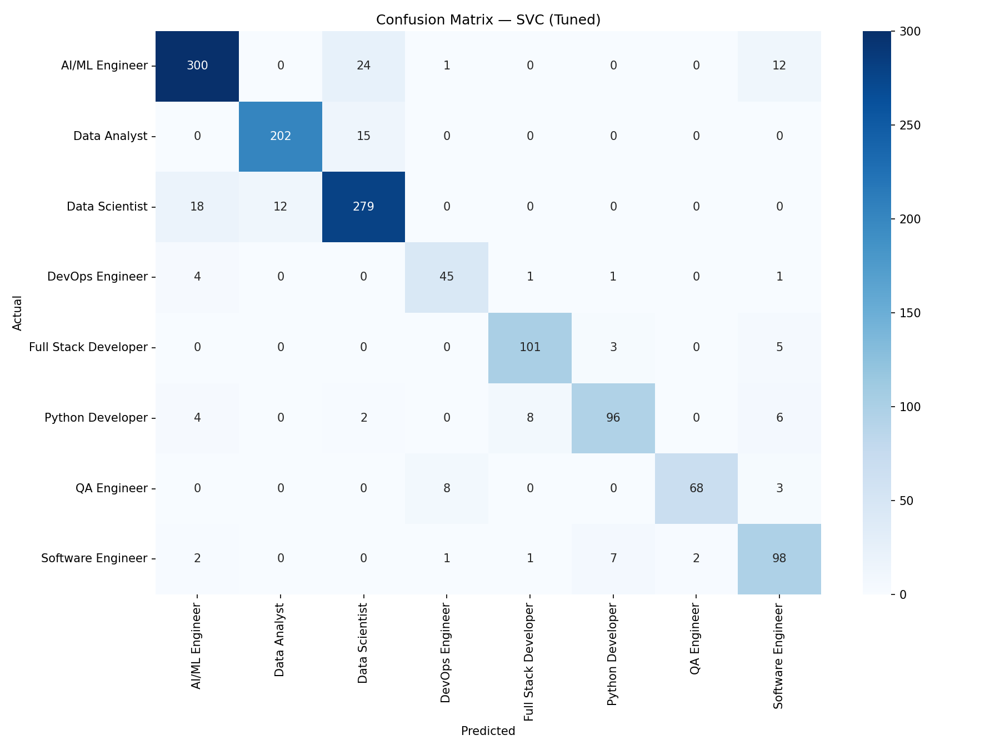

*These two images should be identical — the tuned search converged to the same hyperparameters as the default (`C=1.0, kernel=rbf, gamma=scale`).*

---

#### Random Forest


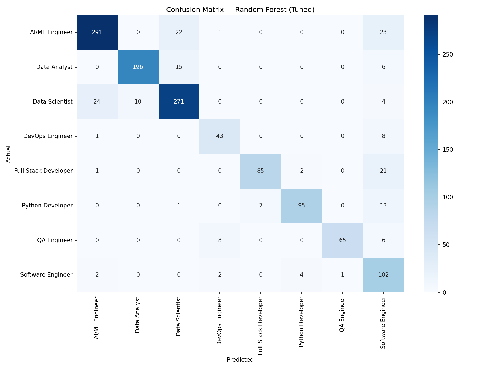

*Worth specifically checking here: since tuned RF scored *worse* on test F1 (0.8518 vs. 0.8751 default), see which classes the regularized grid sacrificed accuracy on.*

---

#### XGBoost


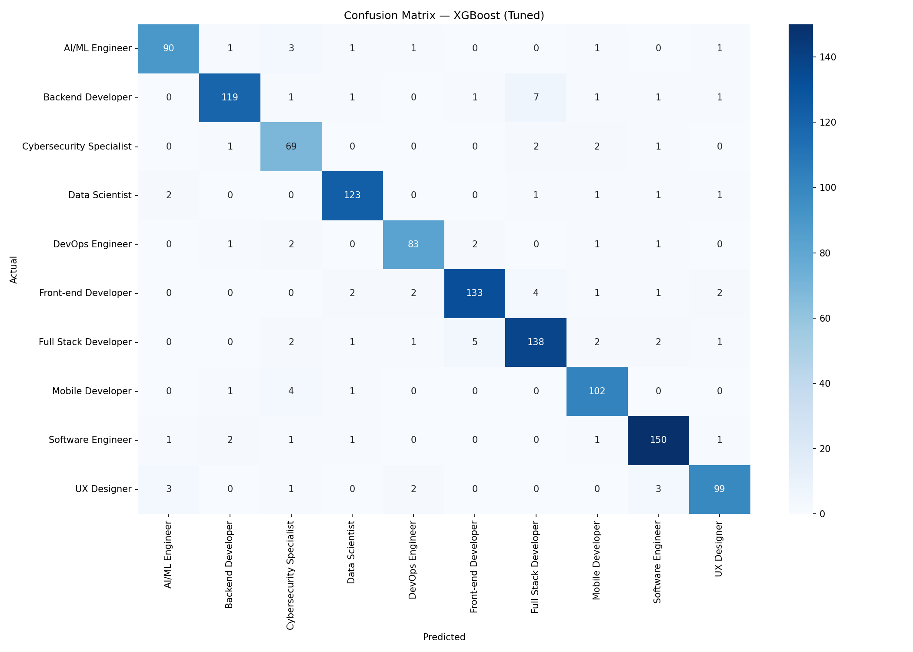

*Tuning improved test F1 here (0.8746 → 0.8843) — check whether that shows up as a broad improvement or is concentrated in a couple of classes.*

---

### Learning Curves

Learning curves plot F1 Macro (y-axis) against training set size (x-axis) for both training score and cross-validation score (`cv=5`). A narrowing gap indicates good generalization; a persistent wide gap signals variance/overfitting.

> As with the confusion matrices, the specific shape commentary below is a placeholder until you've looked at this run's actual plots.

#### Logistic Regression

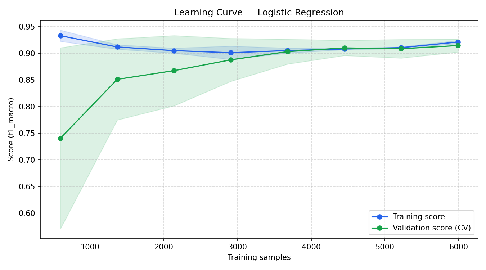
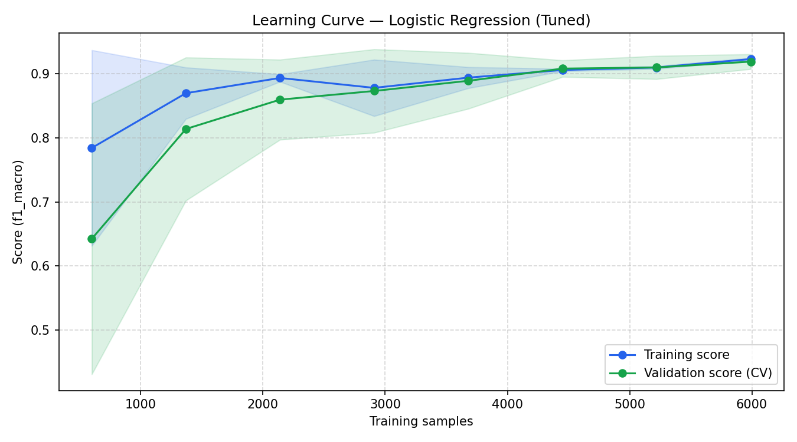

---

#### SVC

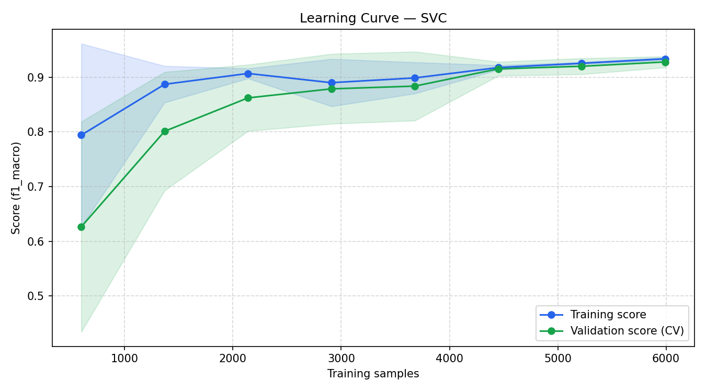
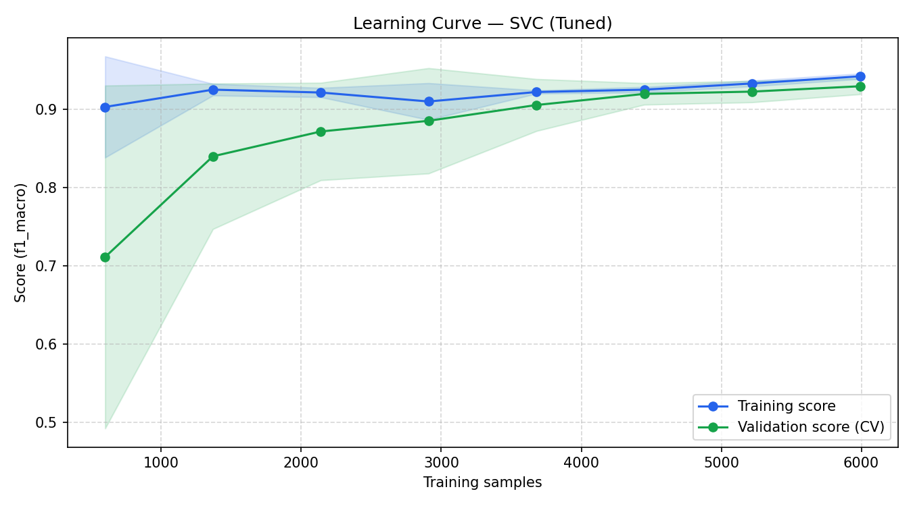

---

#### Random Forest

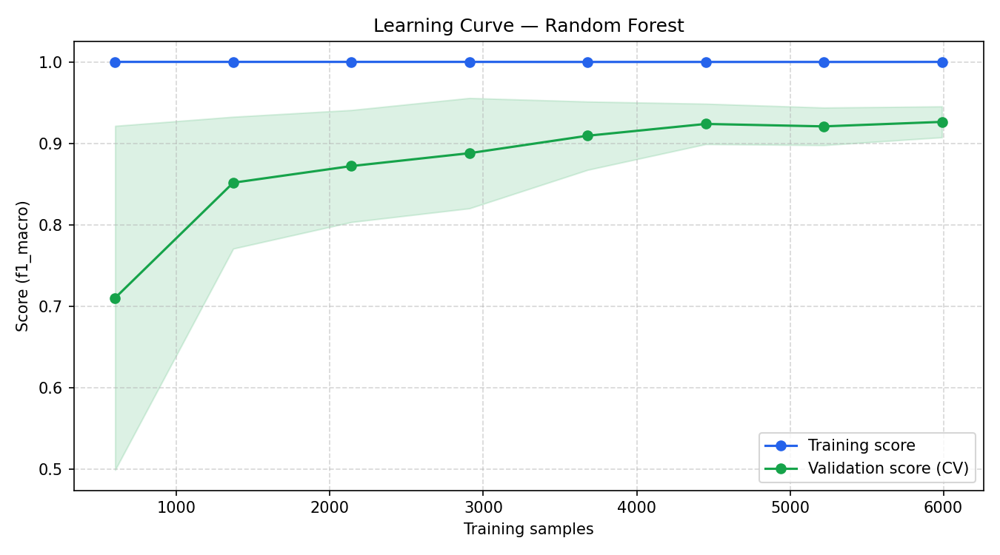
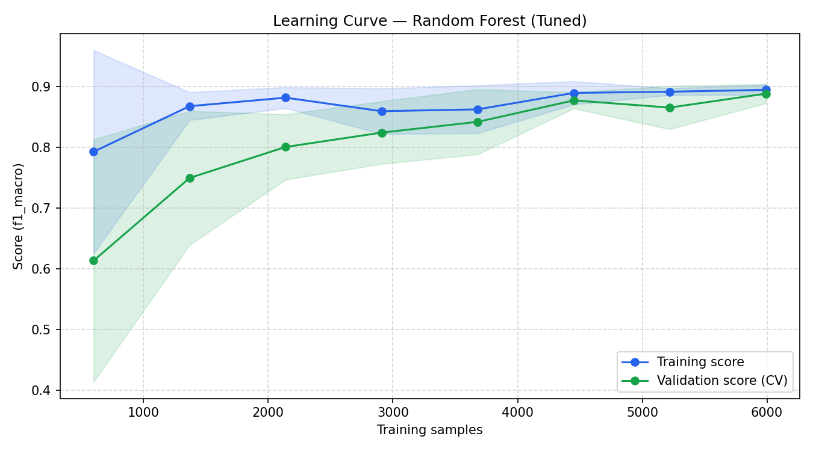

*Default RF's train F1 of 0.9999 (near-perfect memorization) should show as a huge, barely-narrowing gap here — worth including in the writeup as the clearest overfitting example across all 8 models.*

---

#### XGBoost

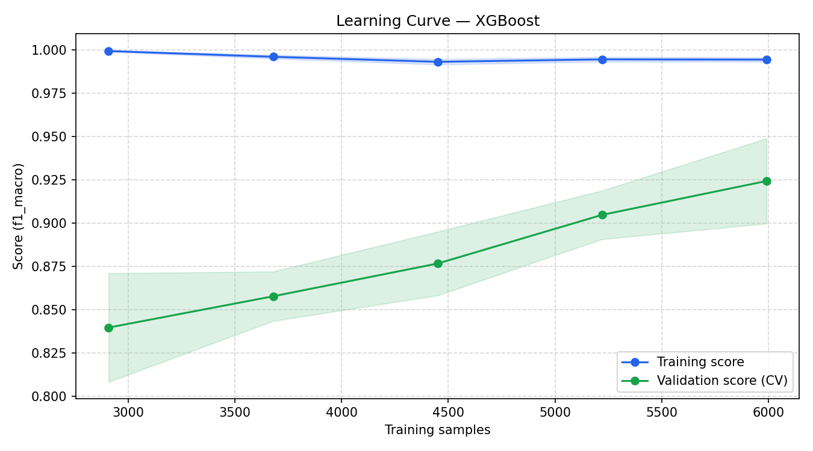
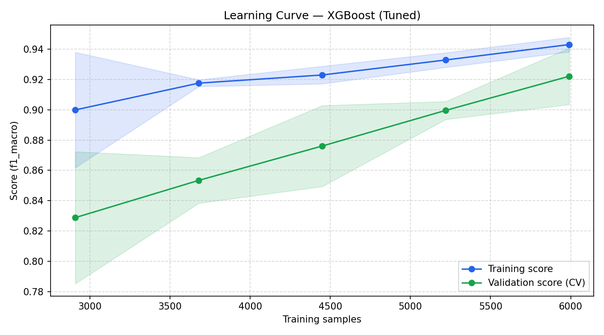

*The tuned curve's gap should visibly narrow vs. default, consistent with the overfit gap dropping from 0.1112 to 0.0668.*

---

### Hyperparameter Tuning

All four models were tuned with `RandomizedSearchCV` (n_iter=50, cv=5, scoring=F1 Macro) — not just the winning baseline. Each search reused the same 5 CV folds as the default-parameter baseline (`StratifiedKFold(5, shuffle=True, random_state=42)`), so default-vs-tuned numbers are directly comparable. `data/artifacts/tuning_results.json` has one entry per model with its `best_params` and full `cv_metrics`.

**Winner: SVC (Tuned) — Test F1 Macro 0.8863, Test MCC 0.8723, CV F1 Macro 0.9292 ± 0.0042** (selected as the highest test F1 macro among the 4 tuned models).

#### Logistic Regression

Best CV F1 Macro: **0.9182 ± 0.0059** (vs. 0.9151 default)

| Parameter | Value |
|---|---|
| `C` | 0.1 |
| `penalty` | `l2` |
| `solver` | `lbfgs` |

More regularization than the default (`C=1.0`) — improved both test F1 (0.8767 → 0.8847) and the overfit gap (0.0444 → 0.0378).

#### SVC — final model

Best CV F1 Macro: **0.9292 ± 0.0042** (identical to default)

| Parameter | Value |
|---|---|
| `C` | 1.0 |
| `kernel` | `rbf` |
| `gamma` | `scale` |

The search landed exactly on SVC's own defaults — i.e., within the searched grid, the untuned SVC was already the best configuration. Default and tuned metrics are therefore identical.

#### Random Forest

Best CV F1 Macro: **0.8902 ± 0.0066** (vs. 0.9239 default — got worse)

| Parameter | Value |
|---|---|
| `n_estimators` | 300 |
| `max_depth` | 20 |
| `min_samples_leaf` | 3 |
| `min_samples_split` | 12 |
| `max_features` | `log2` |

The grid intentionally excludes unrestricted trees (`max_depth=None`) to control overfitting, and it worked — the overfit gap fell from 0.1248 (default RF's train F1 was 0.9999, essentially memorized) to 0.0405. But it overshot: test F1 dropped from 0.8751 to 0.8518. A case worth flagging explicitly in the report — the regularized search space may need widening (e.g., allow `max_depth` up to 25–30, or a smaller `min_samples_leaf` floor) so it can find a better bias/variance tradeoff rather than only exploring the low-variance end.

#### XGBoost

Best CV F1 Macro: **0.9256 ± 0.0043** (vs. 0.9251 default)

| Parameter | Value |
|---|---|
| `n_estimators` | 400 |
| `max_depth` | 5 |
| `learning_rate` | 0.05 |
| `subsample` | 0.9 |
| `colsample_bytree` | 0.7 |
| `min_child_weight` | 3 |
| `gamma` | 0 |
| `reg_alpha` | 0.5 |
| `reg_lambda` | 1 |

CV F1 barely moved, but test F1 improved (0.8746 → 0.8843) and the overfit gap nearly halved (0.1112 → 0.0668) — the cleanest "tuning helped generalization" result of the four models. It finished a close second to SVC (Tuned), 0.002 F1 macro behind.

---

## API Reference

**Base URL:** `http://localhost:8000`

| Method | Endpoint | Description |
|---|---|---|
| `GET` | `/health` | Health check |
| `POST` | `/api/v1/recommend` | Get career recommendations |
| `GET` | `/docs` | Swagger UI |

### POST `/api/v1/recommend`

**Request body**

```json
{
  "skills": ["python", "machine learning", "sql", "tensorflow"],
  "experience": 3.5
}
```

**Response**

```json
{
  "best_career": "AI/ML Engineer",
  "confidence": 0.7434,
  "top_3_recommendations": [
    { "career": "AI/ML Engineer",  "score": 0.7434 },
    { "career": "Data Scientist",  "score": 0.1337 },
    { "career": "Data Analyst",    "score": 0.0666 }
  ]
}
```

**Field descriptions:**

| Field | Type | Description |
|---|---|---|
| `skills` | `list[str]` | Candidate's skills (comma-separated or list) |
| `experience` | `float` | Years of experience |
| `best_career` | `str` | Highest-confidence role |
| `confidence` | `float` | Probability score for the top recommendation |
| `top_3_recommendations` | `list` | Top 3 roles with scores, sorted descending |

---

## Running Training

```bash
cd ml-service
python -m training.train
```

This executes the full pipeline: data loading → preprocessing → SMOTE → train all 4 models with default params (+ 5-fold CV) → hyperparameter-tune all 4 models (RandomizedSearchCV, cv=5) → evaluate every model at both stages → save the best **tuned** model as `best_model.pkl`.

---

## Running the API

```bash
cd ml-service
uvicorn app.main:app --reload
```

Once running, the Swagger UI is available at `http://localhost:8000/docs`.

---

## Artifacts

All outputs are saved to `data/artifacts/` after training:

| File | Description |
|---|---|
| `model_comparison.csv` | Train + test + 5-fold CV metrics for all 8 entries (4 default, 4 tuned) |
| `metrics.json` | `{best_model, default_models: [...], tuned_models: [...]}` — full metrics for all 8 |
| `tuning_results.json` | Best hyperparameters + CV metrics from RandomizedSearchCV, **one entry per model** |
| `classification_report_logistic_regression.txt` | Per-class precision/recall/F1 (default) |
| `classification_report_logistic_regression_tuned.txt` | Per-class precision/recall/F1 (tuned) |
| `classification_report_random_forest.txt` | Per-class precision/recall/F1 (default) |
| `classification_report_random_forest_tuned.txt` | Per-class precision/recall/F1 (tuned) |
| `classification_report_svc.txt` | Per-class precision/recall/F1 (default) |
| `classification_report_svc_tuned.txt` | Per-class precision/recall/F1 (tuned) |
| `classification_report_xgboost.txt` | Per-class precision/recall/F1 (default) |
| `classification_report_xgboost_tuned.txt` | Per-class precision/recall/F1 (tuned) |
| `confusion_matrix_logistic_regression.png` | Confusion matrix heatmap (default) |
| `confusion_matrix_logistic_regression_tuned.png` | Confusion matrix heatmap (tuned) |
| `confusion_matrix_random_forest.png` | Confusion matrix heatmap (default) |
| `confusion_matrix_random_forest_tuned.png` | Confusion matrix heatmap (tuned) |
| `confusion_matrix_svc.png` | Confusion matrix heatmap (default) |
| `confusion_matrix_svc_tuned.png` | Confusion matrix heatmap (tuned) |
| `confusion_matrix_xgboost.png` | Confusion matrix heatmap (default) |
| `confusion_matrix_xgboost_tuned.png` | Confusion matrix heatmap (tuned) |
| `learning_curve_logistic_regression.png` | Learning curve, F1 Macro vs. training size (default) |
| `learning_curve_logistic_regression_tuned.png` | Learning curve, F1 Macro vs. training size (tuned) |
| `learning_curve_random_forest.png` | Learning curve, F1 Macro vs. training size (default) |
| `learning_curve_random_forest_tuned.png` | Learning curve, F1 Macro vs. training size (tuned) |
| `learning_curve_svc.png` | Learning curve, F1 Macro vs. training size (default) |
| `learning_curve_svc_tuned.png` | Learning curve, F1 Macro vs. training size (tuned) |
| `learning_curve_xgboost.png` | Learning curve, F1 Macro vs. training size (default) |
| `learning_curve_xgboost_tuned.png` | Learning curve, F1 Macro vs. training size (tuned) |

`models/` will also now contain **8** classifier files (`logistic_regression.pkl`, `logistic_regression_tuned.pkl`, `svc.pkl`, `svc_tuned.pkl`, `random_forest.pkl`, `random_forest_tuned.pkl`, `xgboost.pkl`, `xgboost_tuned.pkl`) plus `best_model.pkl` (a copy of whichever tuned model won) and the shared encoders (`skill_mlb.pkl`, `scaler.pkl`, `label_encoder.pkl`).